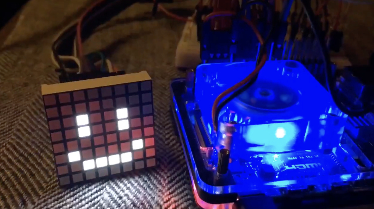

# led-matrix-pi
Display Animation on 8x8 Matrix LED.  
For Raspberry Pi 4B.

## Environment
- Raspberry Pi 4B Model B 2GB Raspberry Pi OS 64-bit 2023-02-21
- Python 3.9

## LED Dot Matrix Display
- OK if it can be controlled directly without passing through a microcontroller.